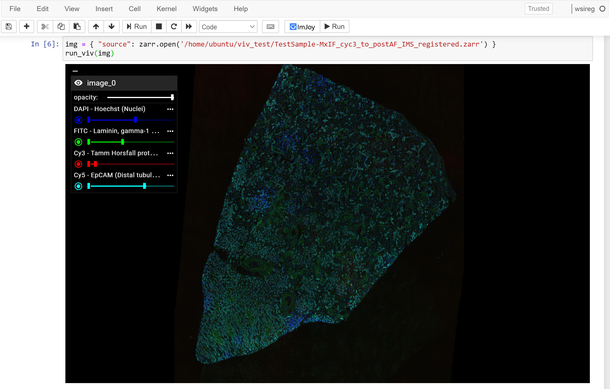

<h1>
<p align="center">
  
</h1>
<samp>
  <p align="center">
    <span>view multiscale zarr images online and in notebooks</span>
      <br>
      <br>
      <a href="https://hms-dbmi.github.io/vizarr/?source=https://minio-dev.openmicroscopy.org/idr/v0.3/idr0062-blin-nuclearsegmentation/6001240.zarr">app</a> .
      <a href="./python/notebooks/getting_started.ipynb">getting started</a>
  </p>
</samp>
</p>

[](https://colab.research.google.com/github/hms-dbmi/vizarr/blob/main/python/notebooks/mandelbrot.ipynb)

<center>
  
</center>

**Vizarr** is a minimal, purely client-side program for viewing zarr-based images.

- ⚡ **GPU accelerated rendering** with [Viv](https://github.com/hms-dbmi/viv)
- 💻 Purely **client-side** zarr access with [zarrita.js](https://github.com/manzt/zarrita.js)
- 🌎 A **standalone [web app](https://hms-dbmi/vizarr)** for viewing entirely in the browser.
- 🐍 An [anywidget](https://github.com/manzt/anywidget) **Python API** for
  programmatic control in notebooks.
- 📦 Supports any `zarr-python` [store](https://zarr.readthedocs.io/en/stable/api/storage.html)
  as a backend.

### Data types

**Vizarr** supports viewing 2D slices of n-Dimensional Zarr arrays, allowing
users to choose a single channel or blended composites of multiple channels
during analysis. It has special support for the developing OME-NGFF format for
multiscale and multimodal images. Currently, Viv supports `int8`, `int16`,
`int32`, `uint8`, `uint16`, `uint32`, `float32`, `float64` arrays, but
contributions are welcome to support more np.dtypes!

### Getting started

Copy and paste a URL to a Zarr store as the `?source` query parameter in the
**[web app](https://hms-dbmi.github.io/vizarr/)**. For example, to view the
[example data](https://minio-dev.openmicroscopy.org/idr/v0.3/idr0062-blin-nuclearsegmentation/6001240.zarr)
from the IDR, you can use the following URL:

```
https://hms-dbmi.github.io/vizarr/?source=https://minio-dev.openmicroscopy.org/idr/v0.3/idr0062-blin-nuclearsegmentation/6001240.zarr
```

Otherwise you can try out the Python API in a Jupyter Notebook, following [the
examples](./python/notebooks/getting_started.ipynb).

```sh
pip install vizarr
```

```python
import vizarr
import zarr

store = zarr.open("./path/to/ome.zarr")
viewer = vizarr.Viewer()
viewer.add_image(store)
viewer
```

### Limitations

`vizarr` was built to support the registration use case above where multiple, pyramidal OME-Zarr images
are viewed within a Jupyter Notebook. Support for other Zarr arrays is supported but not as well tested. 
More information regarding the viewing of generic Zarr arrays can be found in the example notebooks.

### Citation

If you are using Vizarr in your research, please cite our paper:

> Trevor Manz, Ilan Gold, Nathan Heath Patterson, Chuck McCallum, Mark S Keller, Bruce W Herr II, Katy Börner, Jeffrey M Spraggins, Nils Gehlenborg,
> "[Viv: multiscale visualization of high-resolution multiplexed bioimaging data on the web](https://www.nature.com/articles/s41592-022-01482-7)."
> **Nature Methods** (2022), [doi:10.31219/10.1038/s41592-022-01482-7](https://doi.org/10.1038/s41592-022-01482-7)

